# Simplex Router 后台：业务逻辑关系图（for `simplex-cli`）

本文件聚焦两件事：

1. `simplex-cli` 能操作/查询哪些业务域（邀请码、注册、白名单、积分、成本、统计等）
2. 这些业务域背后的实体、数据源、以及它们之间的关系（用于解释指标口径与排障）

## 1) 系统边界与数据源

`simplex-cli` → Simplex Router Backend（`<base-url>/api/...`，注意 CLI 会自动拼 `/api`）→ 多数据源聚合：

- **Postgres（token/cost 统计库）**：`token_usage`、`user_token_totals`、`user_cost_totals`
- **Postgres（anotherme 账号/产品库）**：`users`、`chat_sessions`、`projects`、`dynamic_tables`、`dynamic_rows`、`internal_accounts`、`invite_code_usages`、（以及 credit 相关表如 `accounts`）
- **MongoDB**：会话消息内容（用于 `active-users`）
- **外部服务（Shared Service）**：邀请码、积分流水/调整（通过 `sharedService.baseUrl` + `X-Internal-API-Key`）
- **外部注册 API**：注册用户（`userRegister.apiUrl`；密码使用配置中的 RSA 公钥加密后提交）
- **Resend**：邮件发送

> 影响：同一个“用户”在不同域可能存在不同标识（`user_id:int64` vs `userId:string`）。见 `glossary.md` 的 0)。

## 2) 关系图（概览）

```mermaid
graph TD
  CLI["simplex-cli"] --> API["Backend /api"]

  API --> Auth["Auth (JWT)"]
  API --> Config["Config (base_url/token/output)"]

  API --> Invite["Invite Codes"]
  Invite --> SharedInvite["Shared Service: invite-codes"]
  Invite --> InviteUsages["invite_code_usages (anotherme)"]
  Invite --> Register["User Register"]
  Register --> ExternalReg["External Register API"]

  API --> Whitelist["Internal Accounts (Whitelist)"]
  Whitelist --> InternalAccounts["internal_accounts (anotherme)"]

  API --> Credit["Credits"]
  Credit --> CreditList["users + accounts (anotherme)"]
  Credit --> SharedCredit["Shared Service: credit tx/adjust"]

  API --> TokenUsage["Token Usage"]
  TokenUsage --> TokenDB["token_usage (token db)"]
  TokenUsage --> TokenTotals["user_token_totals (token db)"]
  TokenUsage --> CostTotals["user_cost_totals (token db)"]

  API --> Ranking["User Ranking"]
  Ranking --> AnothermeUsers["users (anotherme)"]
  Ranking --> ChatSessions["chat_sessions (anotherme)"]
  Ranking --> Tables["dynamic_tables/dynamic_rows (anotherme)"]
  Ranking --> InternalAccounts

  API --> ActiveUsers["Active Users"]
  ActiveUsers --> Mongo["Mongo: session messages"]
  ActiveUsers --> ChatSessions
  ActiveUsers --> Projects["projects (share_id)"]
  ActiveUsers --> Tables
  ActiveUsers --> InternalAccounts

  API --> ProjectQuery["Project Data Query"]
  ProjectQuery --> ChatSessions
  ProjectQuery --> Projects
  ProjectQuery --> Tables

  API --> GTM["GTM Conversion"]
  GTM --> AnothermeUsers
  GTM --> ChatSessions
  GTM --> Projects
  GTM --> InternalAccounts

  API --> Email["Resend Email"]
```

## 3) 核心业务域与典型流程

### 3.1 邀请码 → 注册（增长/准入）

1. **生成/创建邀请码**：`simplex-cli invite create|generate`
2. **用邀请码注册用户**：`simplex-cli register user|batch`
3. **查看邀请码使用情况**：`simplex-cli invite usages`

要点：
- 邀请码是 8 位字符串，分 `single_use` 与 `referral`。
- `invite usages` 默认 **排除白名单**（内部账号）。
- 注册成功时会返回 **明文密码**（敏感信息）。

### 3.2 白名单（内部账号）对统计的影响

白名单（`internal_accounts`）用于从各种统计里剔除内部同事账号，常见影响点：

- `ranking list`：默认 `excludeWhitelist=true`（排除）
- `invite usages`：默认 `excludeWhitelist=true`（排除）
- `gtm conversion`：默认 `excludeInternal=true`（排除）
- `active-users list`：默认可能不排除（需要显式传 `--exclude-whitelist=true` 才过滤）

### 3.3 积分（Credits）

- **列表**：`simplex-cli credit list`（账号 + 当前余额）
- **调整**：`simplex-cli credit adjust`（充值/扣除等）
- **流水**：`simplex-cli credit history`

要点：
- `transaction_id` 是幂等键：同一个交易 ID 重试应避免重复扣/充（具体行为依赖后端实现）。
- `amount` 是变动值（正=增加、负=扣除），`balance_after` 是调整后的余额。

### 3.4 成本（Cost limit / budget）

- **查看**：`simplex-cli cost list|get`
- **设置上限**：`simplex-cli cost set-limit --user-id=<userId:string> --limit=<float>`

要点：
- `remainingCost` 通常按 `totalCostLimit - totalCost` 计算并更新。

### 3.5 用量统计（Token usage）

- `simplex-cli user usage <userId:string>`：明细
- `simplex-cli user usage <userId:string> --sessions`：按会话聚合
- `simplex-cli stats overview|today|top`：快速统计

要点：
- 时间筛选常用 RFC3339（ISO8601）。

### 3.6 排名（Ranking）与口径

`simplex-cli ranking list` 返回每个用户（以 email 标识）的排名指标。

常见字段：
- `createChatCount`：时间范围内新增对话次数（chat_sessions）
- `exportCount`：导出次数（dynamic_tables.export_url 非空）
- `matchedRows`：匹配结果行数（聚合口径以实现为准）
- `score`：得分（示例规则：`createChatCount>0` 得 1 分；`exportCount>0` 得 3 分）

### 3.7 活跃用户（Active users）

`simplex-cli active-users list` 输出的是 “用户 × 项目（share link）” 维度：

- 数据来自：Mongo 的会话消息 + Postgres 的 user/project 信息 + dynamic_tables 的行数聚合
- 可能出现：**同一用户多行**（多个项目）

### 3.8 GTM 转化漏斗

`simplex-cli gtm conversion` 返回阶段性统计：

- `register_success`：注册成功用户数
- `first_activation`：首次激活（创建对话）的用户数 + 转化率
- `value_completion`：价值完成（导出/生成邮件）用户数 + 转化率 + 留存

要点：
- 排除内部账号通常默认开启（`excludeInternal=true`）。
- 留存口径以实现为准（例如：时间范围内创建 ≥2 个项目的用户）。

