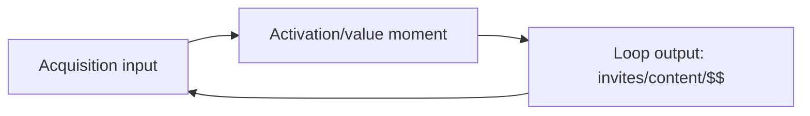

# Templates (Copy/Paste)

Use these templates to produce a **Growth Loop Design Pack**. If writing files, keep everything under a user-specified folder (e.g., `docs/growth-loops/`).

---

## 1) Context snapshot

**Product:**  
**Stage:** pre-PMF / early PMF / growth / mature  
**Target segment(s):**  
**Growth goal (metric + target + date):**  
**Decision this informs:**  
**Current primary channels:**  
**Constraints (budget/capacity/brand/policy/legal/privacy):**  
**Core value moment (definition):**  

---

## 2) Loop inventory + baseline

### Baseline (best available)
| Area | Metric / definition | Current | Source | Notes / confidence |
|---|---|---:|---|---|
| Acquisition volume |  |  |  |  |
| Activation rate |  |  |  |  |
| Retention/engagement proxy |  |  |  |  |
| Referral/share |  |  |  |  |
| Unit economics (if known) | LTV, margin, CAC, payback |  |  |  |

### Existing loops (if any)
| Loop name | Type | Input → Action → Output → Feedback | Strength today (H/M/L) | Evidence |
|---|---|---|---|---|
|  |  |  |  |  |

---

## 3) Loop hypothesis card (for candidates)

**Loop name:**  
**Type:** viral/referral / content/UGC / SEO / partner/integration / sales / paid  
**Target segment:**  
**Core mechanism (1 sentence):**  

### Loop model
- **Input:** (what starts the loop?)
- **Action:** (what users/teams do)
- **Output:** (what gets produced: invites, content, spend, integrations)
- **Feedback:** (how output creates new input)
- **Cycle time:** (how long for one loop turn?)

### Preconditions
- Product prerequisites:
- Operational prerequisites:
- Risk/policy constraints:

### Success definition
- **Loop KPI:**  
- **Leading indicators (early):**  
- **Lagging indicator (business):**  

---

## 4) Loop map (qualitative model)

### Micro loops → macro loop table
| Micro loop | Input | Action | Output | Feedback path | Primary bottleneck |
|---|---|---|---|---|---|
|  |  |  |  |  |  |

### Optional Mermaid diagram (if supported)

---

## 5) Channel fit triad (Customer × Business × Medium)

| Candidate channel | Customer need/context | Business goal fit | Medium strength match (audio/video/text/interactive) | Verdict (Go/No-go) | Notes |
|---|---|---|---|---|---|
|  |  |  |  |  |  |

---

## 6) Paid loop feasibility gate

Use this section if recommending paid acquisition.

**Known/estimated:**
- LTV (gross):  
- Gross margin %:  
- Target CAC:  
- Payback target (months):  

**Gate checks (directional):**
- LTV × margin supports target CAC (and payback window is realistic)
- Retention is strong enough that CAC won’t be “wasted”
- Attribution and conversion tracking are good enough to learn

**Verdict:** viable / not yet viable / needs more data  
**If not yet viable, prerequisites:** (e.g., retention, monetization, onboarding, measurement)

---

## 7) Loop scorecard (pick top 1–2)

| Loop candidate | Impact | Confidence | Effort | Cycle time | Risk | Notes | Total |
|---|---:|---:|---:|---:|---:|---|---:|
|  |  |  |  |  |  |  |  |

Scoring tip: use 1–5 per column, define what “5” means for your context.

---

## 8) Experiment backlog

| Priority | Experiment | Loop | Hypothesis (mechanism) | Metric (leading) | Metric (lagging) | Effort | Timebox | Dependencies |
|---:|---|---|---|---|---|---|---|---|
| 1 |  |  |  |  |  |  |  |  |

---

## 9) Measurement + instrumentation plan

### Metrics
| Loop | KPI (headline) | Leading indicators | Data source | Notes |
|---|---|---|---|---|
|  |  |  |  |  |

### Required events/properties
| Event name | When it fires | Properties | Used for |
|---|---|---|---|
|  |  |  |  |

---

## 10) 30/60/90 plan

### Next 30 days (de-risk + first tests)
-  

### 60 days (iterate toward a working loop)
-  

### 90 days (scale winners, cut losers)
-  

---

## 11) Risks / Open questions / Next steps

**Risks**
-  

**Open questions**
-  

**Next steps**
-  

