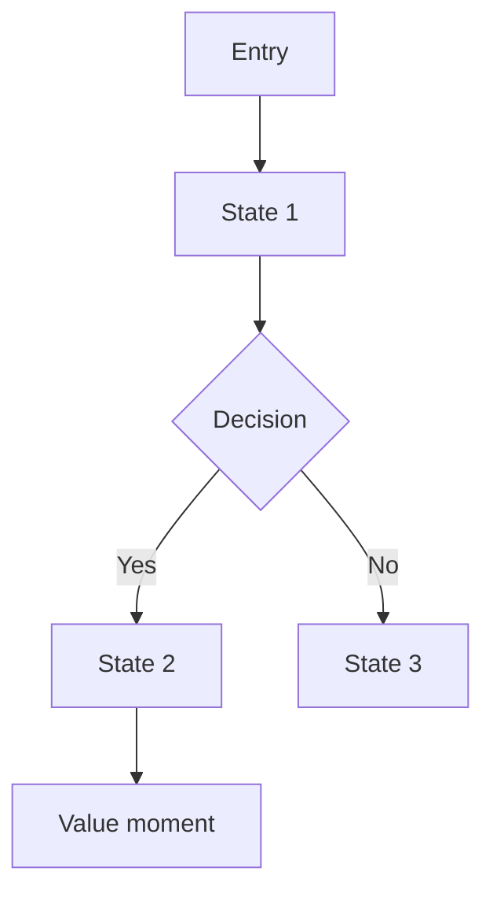
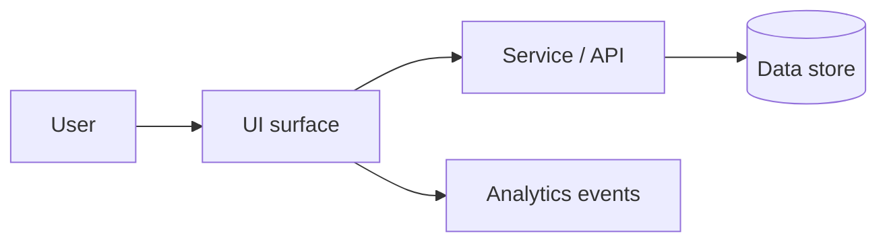

# Templates (Copy/Paste)

Use these templates to produce a **Spec & Design Doc Pack**.

## Template A — Spec & Design Doc (core)

```md
# <Feature name> — Spec & Design Doc

## 0) Context snapshot
- Product:
- Target user(s):
- Problem + why now:
- Decision to be made + DRI/approver:
- Platforms:
- Constraints (timeline, dependencies, policy/legal/privacy):
- Success metrics (1–3):
- Guardrails (2–5):

## 1) Goals / Non-goals / Out of scope
**Goals**
- G1:

**Non-goals**
- NG1:

**Out of scope**
- OOS1:

## 2) Assumptions + dependencies
- A1:
- D1:

## 3) Low‑fidelity diagram (moving pieces)
<Mermaid diagram or ASCII sketch>

## 4) User flows
### 4.1 Happy path
<Flow diagram + narrative>

### 4.2 Edge cases
- E1:
- E2:

## 5) States (per key screen/component)
| Screen/state | Trigger | UI/content | System behavior | Analytics/event | Notes |
|---|---|---|---|---|---|
| Empty |  |  |  |  |  |
| Loading |  |  |  |  |  |
| Error |  |  |  |  |  |
| Success |  |  |  |  |  |

## 6) Prototype brief (only if “feel” matters)
- Decision the prototype enables:
- What to prototype (1–3 scenarios):
- Fidelity (lo-fi / hi-fi / in-code):
- Data realism (realistic examples, real data if possible):
- Timebox:
- Reviewers:
- Success criteria:

## 7) Requirements + acceptance criteria
| ID | Requirement | Priority | Acceptance criteria | Notes |
|---|---|---|---|---|
| R1 |  | Must/Should/Could |  |  |

## 8) Measurement plan
| Metric/guardrail | Definition | Data/events needed | Owner | Cadence |
|---|---|---|---|---|
|  |  |  |  |  |

## 9) Risks / Open questions / Next steps
**Risks**
- R:

**Open questions**
- Q:

**Next steps**
- N:
```

## Template B — Low‑fidelity diagram (Mermaid)

### Option 1: Flowchart


### Option 2: System “moving pieces”


## Template C — Tap economy worksheet (mobile)

```md
## Tap economy (mobile)

**First value event:** <what the user gets that proves value>
**Tap budget target:** <e.g., 3 taps from entry to value>

| Step | Screen/action | Tap count | Friction risk | Tap removal ideas |
|---|---|---:|---|---|
| 1 |  | 1 |  |  |
```

## Template D — Prototype brief (standalone)

```md
# Prototype brief — <Feature>

## Decision to enable
<What choice should this prototype help make?>

## Scenarios to prototype (max 3)
1) <scenario>

## Fidelity + tooling (high level)
- Fidelity: lo-fi / hi-fi / in-code
- Notes: keep it disposable unless explicitly promoted to production code

## Data realism
- Sample data needed:
- “Real data” approach (if possible):

## Timebox + reviewers
- Timebox:
- Reviewers:

## Success criteria (“feel”)
- Users can:
- Time to complete:
- Comprehension checks:
```

